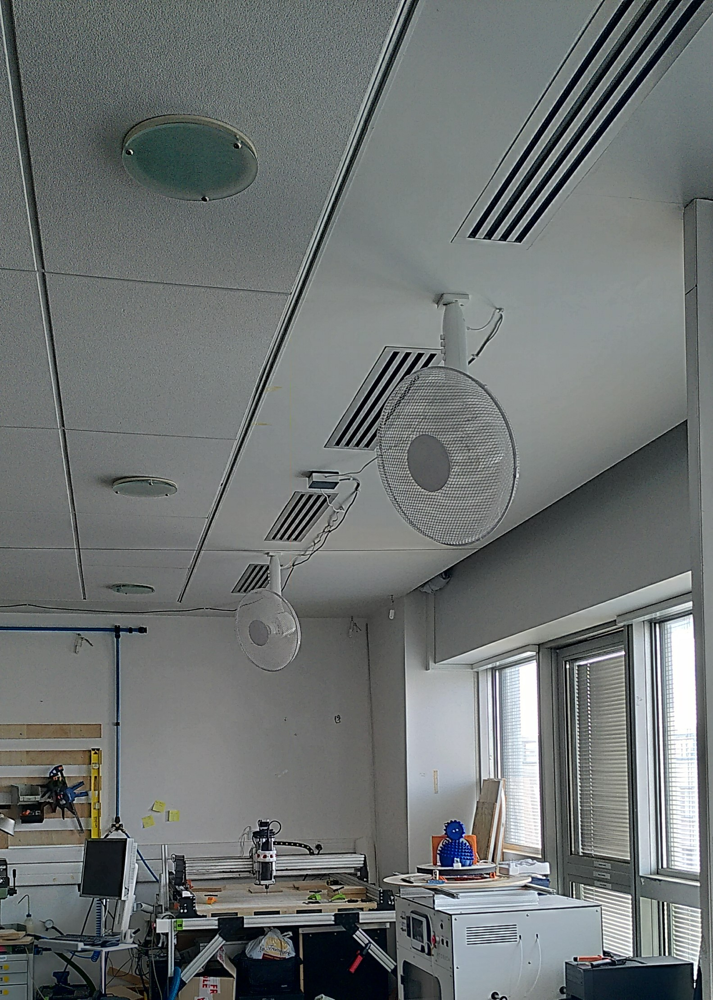
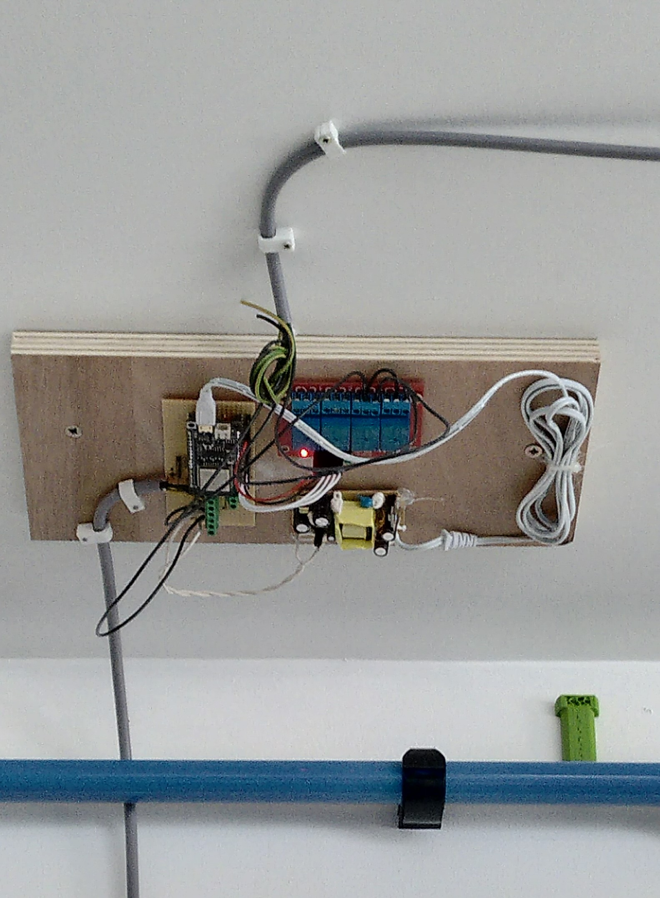
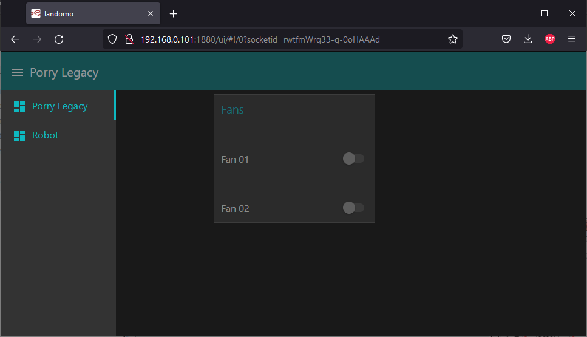
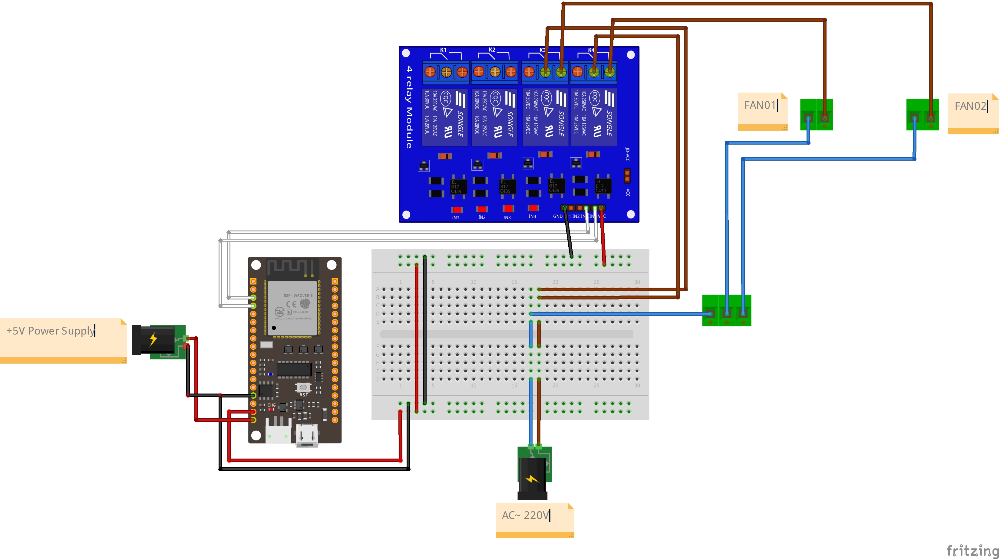
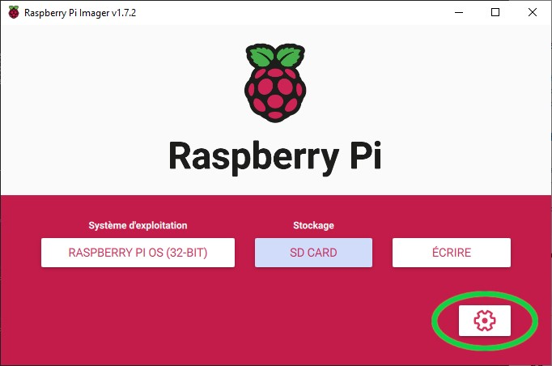

# Porry Legacy

Contrôle de la ventilation par interface web.  

**Elements**

- Routeur pour monter un réseau local
- Raspberry pi
- esp32
- relais

## Installation





## Map

1|2|3|4|5|
:-:|:-:|:-:|:-:|:-:|
Neutre|Phase|Fan 1|Fan 2|Terre
boitier COM|R3 + R4|Relais 3|Relais 4|N/A

Relais 3|Relais 4
:-:|:-:|
26|25



## Raspberry Pi

### PiImager - Network

**Préparation**

Télécharger `https://www.raspberrypi.com/software/`

Choisir *Raspberry Pi OS Lite (32bit)*

Paramétrer le réseau, le mot de passe du réseau et activer le ssh avant d'écrire sur la carte


**Connexion**

Pour trouver l'adresse du PI sur le réseau local : 

1. brancher un écran et un clavier. Entrer `hostname -I` dans le terminal
2. Utiliser un scane réseau comme `https://nmap.org/download`

**SSH**

Ouvrir un terminal

`ssh <Username>@<Your_RPi_IP_address>`


### NodeRed

**Installation**
```
bash <(curl -sL https://raw.githubusercontent.com/node-red/linux-installers/master/deb/update-nodejs-and-nodered)
sudo systemctl enable nodered.service
sudo reboot
```
**Dashboard**
```
node-red-stop
cd ~/.node-red
npm install node-red-dashboard
sudo reboot

```
**Check installation**

- programmation : 
  
    `http://<YOUR_RPi_IP_ADDRESS>:1880`

- visualisation : 

    `http://<Your_RPi_IP_address>:1880/ui`

**Import Flows**

Une fois connecté à l'interface NodeRed : 
- burger menu -> *Import*
- *select a file to import*
- `_scr/flows.json`

### Mosquitto

```
sudo apt update && sudo apt upgrade
sudo apt install -y mosquitto mosquitto-clients
sudo systemctl enable mosquitto.service
```

**Configuration**

`sudo nano /etc/mosquitto/mosquitto.conf`<br/>
`listener 1883`<br/>
`allow_anonymous true`

### FireBettle - ESP32

**configuration arduino**

`https://wiki.dfrobot.com/FireBeetle_ESP32_IOT_Microcontroller(V3.0)__Supports_Wi-Fi_&_Bluetooth__SKU__DFR0478`

**Upload**

`porry_legacy.ino`